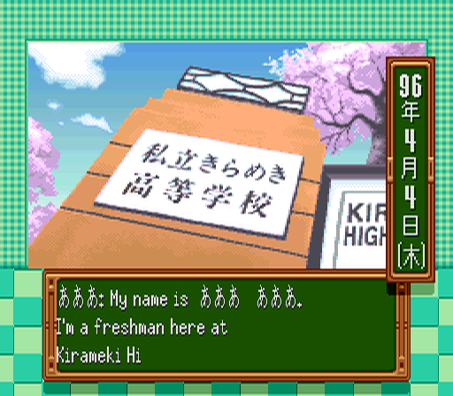
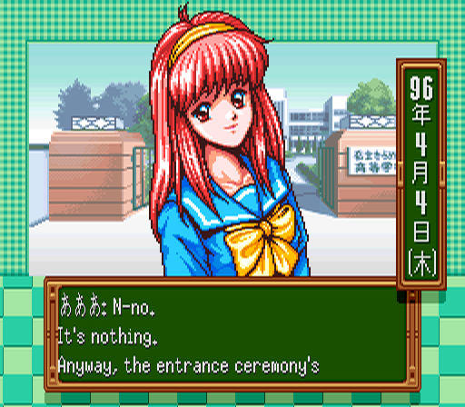
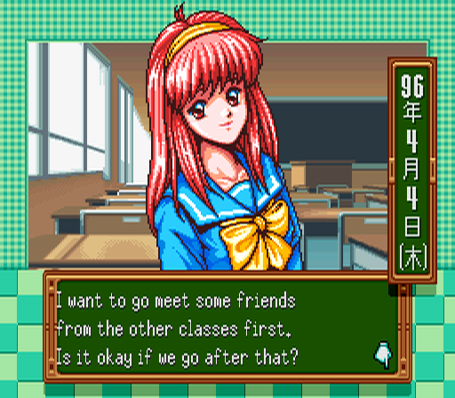
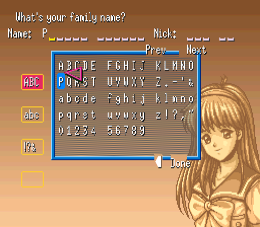
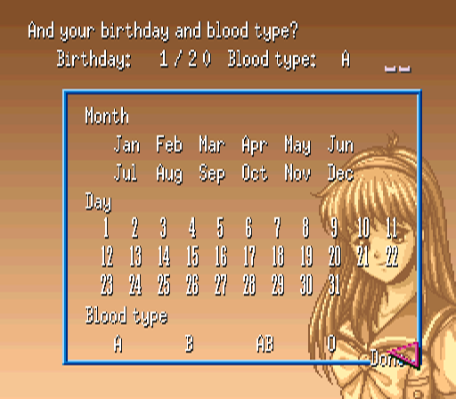
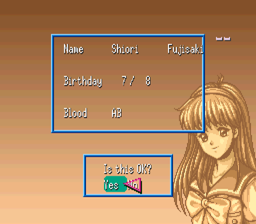

# Tokimeki Memorial: Densetsu no Ki no Shita de (SNES) – English Translation

Fan translation of Konami's *Tokimeki Memorial: Densetsu no Ki no Shita de* (Super Famicom, 1996)
from Japanese into English.

> **Status: early development (v0.2-dev).** The text engine works, the prologue is translated and
> a new game can be started in English (name entry, birthday and confirmation screens).
> The rest of the game is still in Japanese. This patch is meant for testing, not for playing.

| Screen | |
|---|---|
|  |  |
|  |  |
|  |  |
|  | |

## Progress

| Area | Status |
|---|---|
| Text engine (ROM expanded to 48 Mbit, variable width font, English control codes) | ✅ done |
| Script extraction (22,690 dialogue messages, ~390,000 Japanese characters) | ✅ done |
| Prologue | ✅ translated |
| Speaker names | ✅ translated |
| Name entry (English letters, 6 characters per name), birthday/confirmation screens | ✅ done |
| Menus, status screen, calendar | ⬜ planned (milestone 2) |
| Main script (all girls and events) | ⬜ 0.4 % |
| Graphics with Japanese text (title, menus, signs) | ⬜ planned |

Milestones: **M1** prologue playable ✅ → **M2** all menus/UI (in progress) → **M3** full script (alpha) →
**M4** graphics → **M5** version 1.0.

## How to patch

You need the Japanese ROM (no copier header):

| | |
|---|---|
| File size | 4,194,304 bytes (32 Mbit) |
| CRC32 | `6A3CCEB1` |
| SHA-1 | `d025db012acc9a35e79991e25eb5a301ea7afdf0` |

Apply `patches/TokimekiMemorial_EN_v0.2-dev.bps` with [Floating IPS](https://www.romhacking.net/utilities/1040/)
or [Rom Patcher JS](https://www.marcrobledo.com/RomPatcher.js/) (an `.ips` version is included as well).
The patched ROM is 48 Mbit (ExLoROM) – SHA-1 `60da008a14b053e4addee2dd27674d7191a87de6`.

Tested with: Snes9x. Other emulators and the FXPak Pro / SD2SNES still need to be tested.

## Notes

- Names can be up to 6 characters (family name, first name, nickname). Grid pages: upper case,
  lower case, symbols. The fourth tab is unused.
- Birthday/blood type screens and the main game use a pointer: move it with the D-pad, press A on an
  entry, Start to confirm.
- Names are in Western order (Shiori Fujisaki); honorifics (-kun, -chan, -san) are kept.

## Legal

This is an unofficial fan project and is not affiliated with Konami. No ROM or copyrighted
game data is distributed here – only a patch. Tokimeki Memorial is a trademark of Konami.

The English font is based on the X11 *misc-fixed* 6x13 font, which is in the public domain.
