# Tokimeki Memorial: Densetsu no Ki no Shita de (SNES) – English Translation

Fan translation of Konami's *Tokimeki Memorial: Densetsu no Ki no Shita de* (Super Famicom, 1996)
from Japanese into English.

> **Status: alpha (v0.6.1-dev).** The complete dialogue script (all 22,690 event messages) is now
> translated, together with the menus, status panel, Yoshio's notebook, system messages, battle texts,
> mini-game instructions, the speech contest and the graphics with Japanese text. This is a first,
> raw translation that has only been spot-checked in an emulator – expect typos, awkward lines and
> layout glitches. Bug reports are very welcome.

| Screen | |
|---|---|
|  |  |
|  |  |
|  |  |
|  | 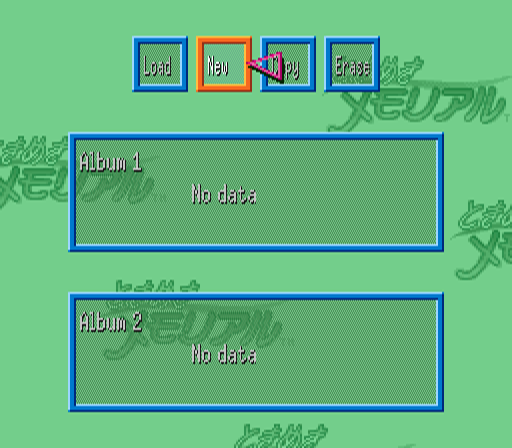 |
| 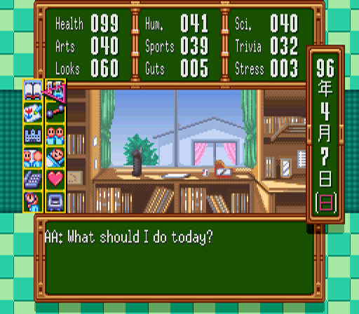 | 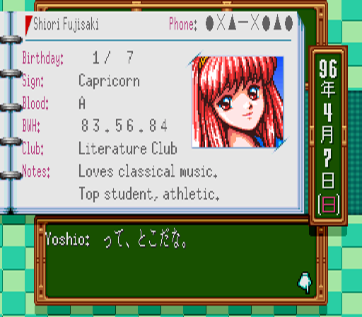 |
| 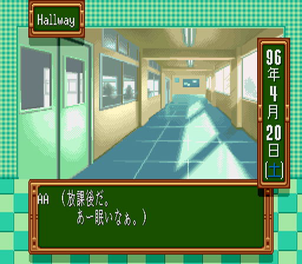 | 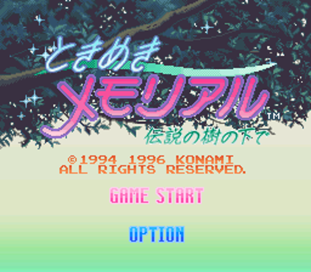 |
| 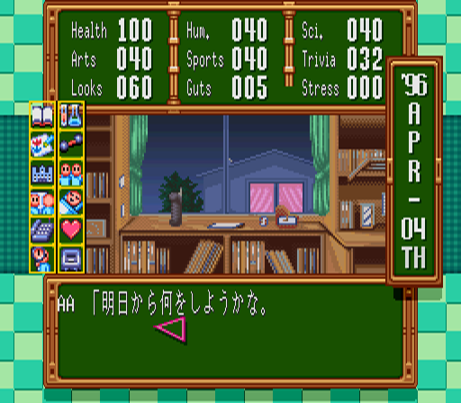 | 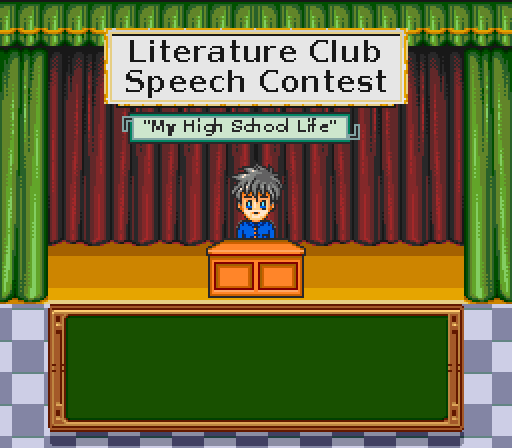 |
| 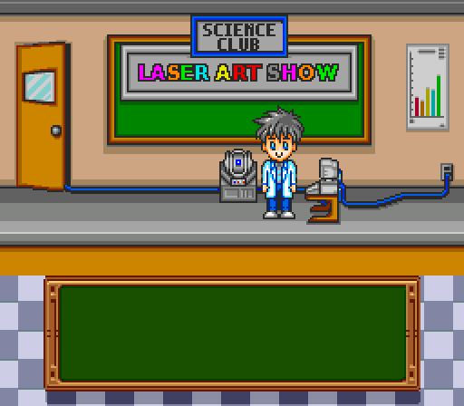 | 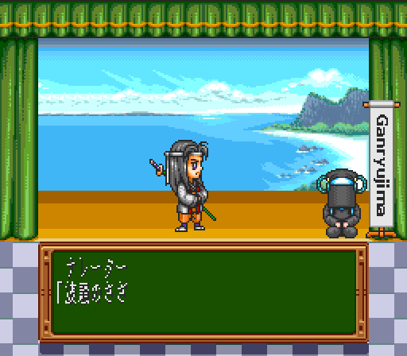 |
| 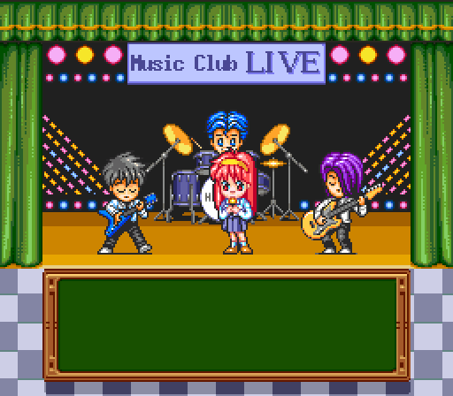 | 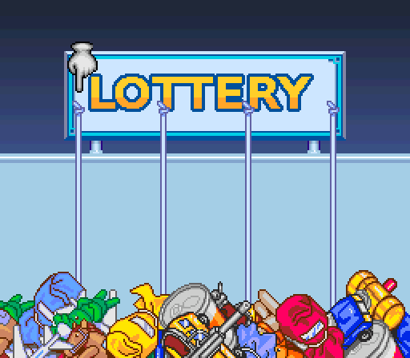 |
| 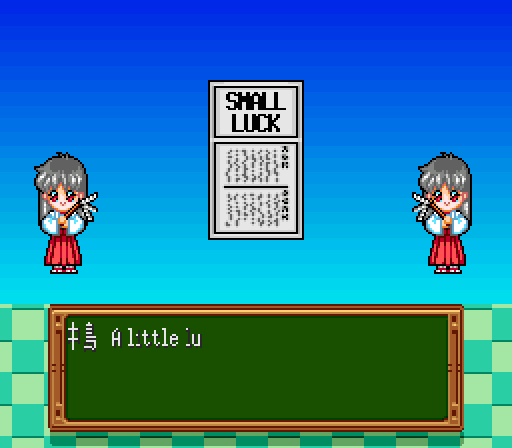 | 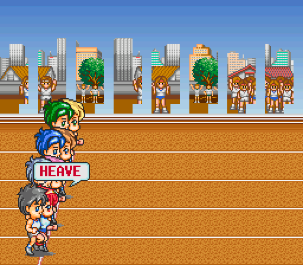 |
| 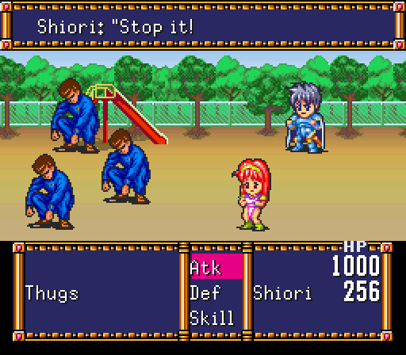 | 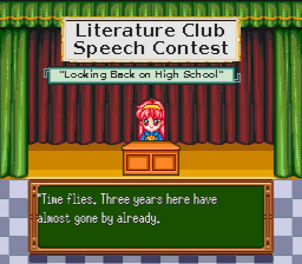 |
| 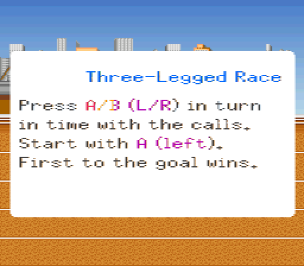 | 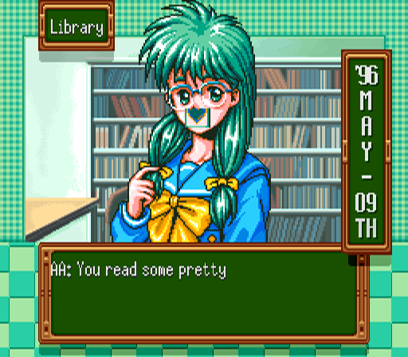 |
| 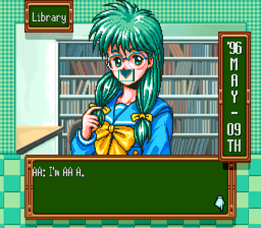 | 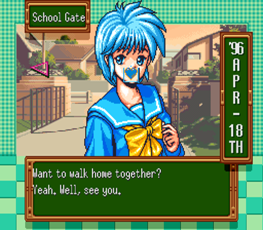 |
| 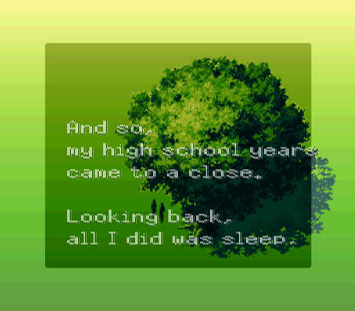 | |

## Progress

| Area | Status |
|---|---|
| Text engine (ROM expanded to 48 Mbit, variable width font, English control codes) | ✅ done |
| Script extraction (22,690 dialogue messages, ~390,000 Japanese characters) | ✅ done |
| Prologue | ✅ translated |
| Speaker names | ✅ translated |
| Name entry (English letters, 6 characters per name), birthday/confirmation screens | ✅ done |
| Menus, status panel, Yoshio's notebook (profiles, ratings), system messages, mini-game texts, credits | ✅ done (some screens not yet tested in-game) |
| Battle texts (fights in the sub-games and events) | ✅ done |
| Title menu and date panel (graphics) | ✅ done |
| Graphics with Japanese text (festival stages, mini-games, signs, banners, award ceremonies) | ✅ done – the logo, the school name plate, the Koshien stadium and the Miss Kirameki poster stay Japanese on purpose |
| Main script (all girls and events, endings, epilogue) | ✅ translated (alpha, raw translation) |
| Confession scenes at the end (pre-rendered text graphics) | ⬜ still Japanese |

Milestones: **M1** prologue playable ✅ → **M2** all menus/UI ✅ → **M3** full script (alpha) ✅ →
**M4** graphics (mostly done, see above) → **M5** version 1.0.

## How to patch

You need the Japanese ROM (no copier header):

| | |
|---|---|
| File size | 4,194,304 bytes (32 Mbit) |
| CRC32 | `6A3CCEB1` |
| SHA-1 | `d025db012acc9a35e79991e25eb5a301ea7afdf0` |

Apply `patches/TokimekiMemorial_EN_v0.6.1-dev.bps` with [Floating IPS](https://www.romhacking.net/utilities/1040/)
or [Rom Patcher JS](https://www.marcrobledo.com/RomPatcher.js/) (an `.ips` version is included as well).
The patched ROM is 48 Mbit (ExLoROM) – SHA-1 `d8603733594ee74ba076ba70cbf23f77880ec38c`.

Tested with: Snes9x. Other emulators and the FXPak Pro / SD2SNES still need to be tested.

## Notes

- Names can be up to 6 characters (family name, first name, nickname). Grid pages: upper case,
  lower case, symbols. The fourth tab is unused.
- Birthday/blood type screens and the main game use a pointer: move it with the D-pad, press A on an
  entry, Start to confirm.
- Names are in Western order (Shiori Fujisaki); honorifics (-kun, -chan, -san) are kept.
- Known issues: the girls' confessions at the end are pre-rendered text graphics and still in
  Japanese.
- The song lyrics shown during the Music Club concert stay Japanese (the songs are instrumental).

## Legal

This is an unofficial fan project and is not affiliated with Konami. No ROM or copyrighted
game data is distributed here – only a patch. Tokimeki Memorial is a trademark of Konami.

The English font is based on the X11 *misc-fixed* 6x13 font, which is in the public domain.
